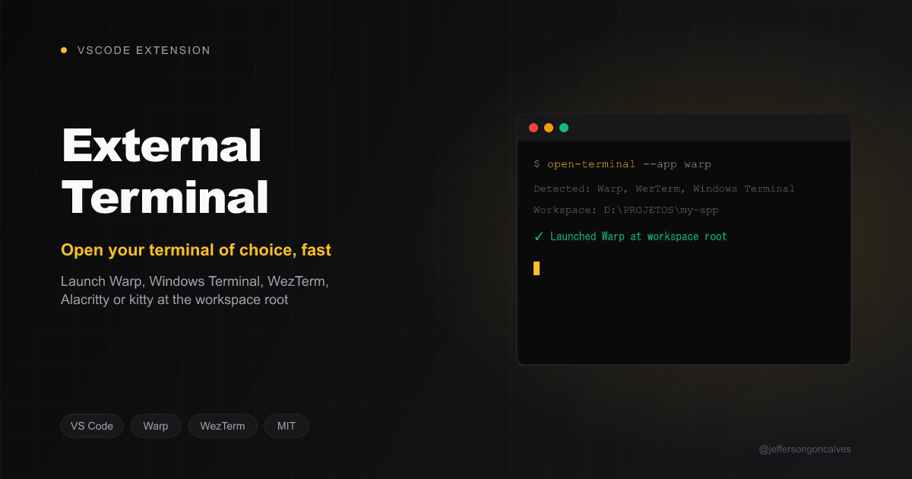

# External Terminal Launcher

[](https://buymeacoffee.com/jeffersongoncalves)

Open Warp, Windows Terminal, WezTerm, Alacritty or kitty at the workspace root without leaving VSCode.

## Features

- **One-click launch** — status bar item opens the configured terminal at the workspace root.
- **Tab reuse** — opens a new tab in an existing window when the terminal supports it.
- **Custom executable path** — point each terminal at a non-standard install location.
- **Terminal-agnostic** — Warp, Windows Terminal, WezTerm, Alacritty, kitty.

## Requirements

- VS Code 1.85+
- At least one of Warp, Windows Terminal, WezTerm, Alacritty, or kitty installed

## Installation

Install from the `.vsix` (see [Development](#development)) via **Extensions → ⋯ → Install from VSIX...**, or from the VS Code Marketplace once published.

## Commands

| Command | Description |
|---|---|
| `External Terminal: Open External Terminal` | `externalTerminal.open` |

## Settings

| Setting | Default | Description |
|---|---|---|
| `externalTerminal.selectedTerminalId` | `warp` | `warp`, `windows-terminal`, `wezterm`, `alacritty`, or `kitty` |
| `externalTerminal.reuseTab` | `true` | Reuse an existing window as a new tab when the terminal supports it |
| `externalTerminal.executablePaths` | `{}` | Per-terminal executable path override, keyed by terminal id |

## Development

```bash
npm install
npm run watch
```

Press `F5` in VSCode to launch an Extension Development Host.

```bash
npm test      # run unit tests
npm run lint  # eslint
npm run package && npx vsce package  # build a .vsix
```

## License

[MIT](LICENSE)

## Author

**Jefferson Gonçalves** — [GitHub](https://github.com/jeffersongoncalves)
